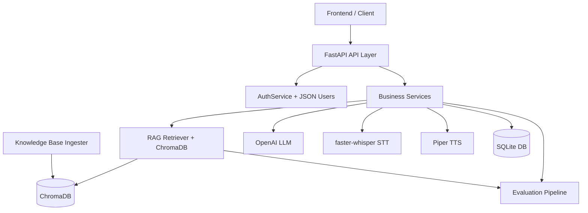
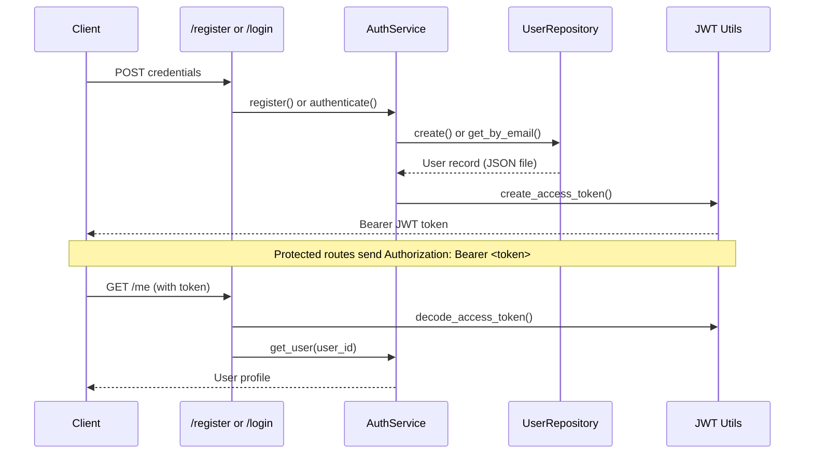
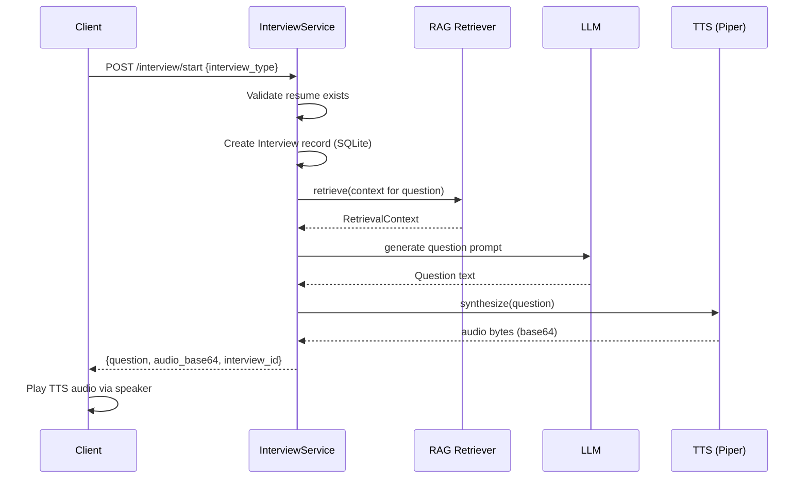

# PrepWise AI Backend — Complete Flow Documentation

This document describes the **entire backend lifecycle** from user registration to interview completion.

---

## Folder Structure

```
backend/
├── api/                 # FastAPI route handlers
├── services/            # Business logic
├── repositories/        # JSON data access (users)
├── rag/                 # Retrieval pipeline (ChromaDB)
├── evaluation/          # Quality metrics
├── database/            # SQLAlchemy models + SQLite
├── models/              # Domain models (User)
├── prompts/             # LLM prompt templates
├── schemas/             # Pydantic request/response models
├── utils/               # JWT, logging, file parsing
├── tests/               # pytest suite
└── docs/                # This documentation
```

---

## High-Level Architecture



---

## 1. Application Startup

```
uvicorn main:app
    ↓
setup_logging()
    ↓
init_db() → create SQLite tables
    ↓
RAGRetriever.ensure_knowledge_base()
    ↓
KnowledgeBaseIngester.ingest()
    → scan knowledgebase/*.md
    → chunk + embed + upsert to ChromaDB
    ↓
Server ready on :8000
```

---

## 2. Authentication Flow



**Storage:** `data/users.json` (not SQLite)

---

## 3. Resume + Job Description Upload

```
POST /resume (PDF/DOCX)
    ↓
extract_text_from_file()
    ↓
parse_resume_sections() → skills, education, projects, experience
    ↓
Save to SQLite (resumes table)
    ↓
RAGRetriever.index_user_documents(user_id, resume, jd)
    ↓
DocumentChunker → OpenAI Embeddings → ChromaDB collection "user_{id}"
```

```
POST /job-description (PDF or text)
    ↓
Extract text → Save to SQLite
    ↓
Re-index user documents in ChromaDB
```

---

## 4. RAG Retrieval Pipeline

Every question, evaluation, quiz, and analysis **must go through retrieval**.

```
Query Construction:
  interview_type + role + difficulty + conversation_history + previous_questions
    ↓
Parallel Retrieval:
  ├── user_{id} collection (resume + JD chunks)
  └── knowledge_base collection (filtered by interview_type metadata)
    ↓
Score threshold filter (≥ 0.35)
    ↓
Deduplicate + rank (prefer resume/JD over KB)
    ↓
RetrievalContext → PromptBuilder → LLM
    ↓
RetrievalEvaluator logs metrics
```

**Graceful fallback:** If no chunks pass threshold, log warning and use explicit "limited context" message — never silent hallucination.

---

## 5. Voice Interview Lifecycle

### User clicks "Start Interview"



### User speaks answer

```
Client records microphone audio
    ↓
POST /interview/answer (multipart: interview_id + audio.webm)
    ↓
STT (faster-whisper) → transcribed text
    ↓
RAG retrieve context for evaluation
    ↓
LLM evaluate → JSON scores (technical, communication, confidence, completeness)
    ↓
Update InterviewQuestion + transcript in SQLite
    ↓
Adjust difficulty (+1 / 0 / -1)
    ↓
If more questions:
    → Generate next question (RAG + LLM, avoid repeats)
    → TTS synthesize → return next_audio_base64
If last question:
    → Generate final report (LLM)
    → Mark interview completed
```

### Interview Ends

```
Finalize:
    ↓
LLM generates report JSON (overall score, strengths, weaknesses, recommendations)
    ↓
InterviewEvaluator checks for repeated questions, topic coverage
    ↓
PerformanceTracker logs total pipeline latency
    ↓
Client navigates to GET /report/{id}
```

---

## 6. Quiz Generation Flow

```
POST /practice {topic, difficulty, num_questions}
    ↓
RAG retrieve(topic + quiz_type context)
    ↓
PromptBuilder.build_quiz_prompt(context from retrieval)
    ↓
LLM → JSON array of questions
    ↓
QuizEvaluator validates structure
    ↓
Save to SQLite (practice_quizzes)
    ↓
Return questions to client
```

Supported types: MCQ, multiple_correct, true_false, scenario, coding_theory

---

## 7. Resume Analysis Flow

```
GET /resume/analysis
    ↓
RAG retrieve("resume analysis keywords gaps")
    ↓
PromptBuilder.build_resume_analysis(resume + JD + KB context)
    ↓
LLM → JSON (missing keywords, weak bullets, grammar, impact, links, score)
    ↓
Save analysis on Resume record
```

---

## 8. Learn Page Flow

```
GET /learn
    ↓
Gather weak topics from last 3 completed interviews
    ↓
RAG retrieve(weak topics + skills)
    ↓
LLM → 5 learning cards with resources + mini quiz
    ↓
Replace user's learning cards in SQLite
```

---

## 9. Evaluation Pipeline

Every major operation emits evaluation records to `data/evaluations/`:

| Category | When | Metrics |
|----------|------|---------|
| knowledge_base | Startup / reindex | chunk count, metadata coverage |
| retrieval | Every RAG query | precision@k, relevancy, latency, fallback |
| prompt | Question generation | missing variables, context length |
| interview | Interview complete | repeated questions, difficulty range |
| quiz | Quiz generated | structure validity, explanations |
| speech | STT/TTS calls | provider, latency, fallback used |
| performance | End of request | total pipeline timing |

---

## 10. API Request Map

| Endpoint | Auth | Service | Key Dependencies |
|----------|------|---------|------------------|
| POST /register | No | AuthService | JSON users |
| POST /login | No | AuthService | JSON users |
| GET /me | Yes | AuthService | JWT |
| POST /resume | Yes | ResumeService | File parser, RAG |
| GET /resume/analysis | Yes | ResumeService | RAG, LLM |
| POST /job-description | Yes | JobDescriptionService | RAG |
| POST /interview/start | Yes | InterviewService | RAG, LLM, TTS |
| POST /interview/answer | Yes | InterviewService | STT, RAG, LLM, TTS |
| GET /report/{id} | Yes | Report API | SQLite |
| GET /history | Yes | History API | SQLite |
| GET /dashboard | Yes | DashboardService | SQLite |
| GET /learn | Yes | LearnService | RAG, LLM |
| POST /practice | Yes | PracticeService | RAG, LLM |

---

## 11. Data Flow Summary

```
User Input (voice/text/files)
    ↓
API Validation (Pydantic + HTTPBearer)
    ↓
Service Layer (business rules)
    ↓
┌─────────────────────────────────────┐
│  RAG (always for AI generation)     │
│  LLM (generation + evaluation)      │
│  STT/TTS (voice pipeline)           │
│  Evaluation (quality metrics)       │
└─────────────────────────────────────┘
    ↓
Persistence (SQLite + JSON + ChromaDB + evaluation logs)
    ↓
Response (JSON + base64 audio)
```

---

## 12. Conversation Memory

Interview conversation state is stored in:
- `interviews.transcript` — JSON array of {role, text}
- `interview_questions` — per-question scores and feedback
- `interviews.difficulty_level` — adaptive difficulty (1–5)

Each new question retrieval includes:
- Full Q&A history
- Previous question texts (duplicate prevention)
- Current difficulty level
- Role extracted from JD

---

## 13. Logging & Traceability

Each interview session sets a `trace_id` (e.g., `interview-42-1712345678`).

All logs for that session include the trace ID, enabling:
- Retriever query → chunks → scores
- Prompt variables → LLM response
- STT/TTS provider and latency
- Evaluation metrics saved to disk

Enable JSON logs: `LOG_JSON=true` in `.env`
